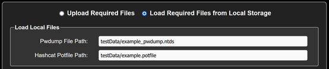
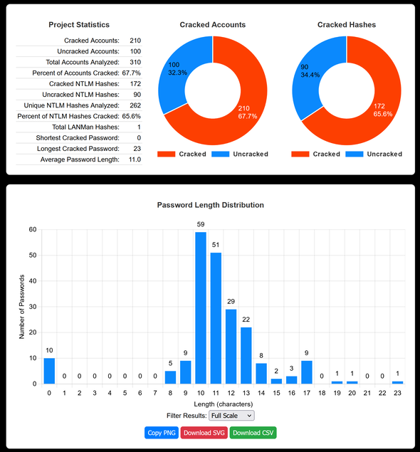

# **Hash Master 1000** Documentation

---

### **Table of Contents**

1.  [Security Disclaimer](#security-disclaimer)
2.  [Introduction](#introduction)
3.  [Use Cases](#use-cases)
4.  [Application Startup](#application-startup)
5.  [Default Login](#default-login)
6.  [Inputs](#inputs)
7.  [Configurable Settings](#configurable-settings)
8.  [Output Report](#output-report)
9.  [Hash Dumping Methods](#hash-dumping-methods)
10. [Licensing](#licensing)

---

## **Security Disclaimer**

Hash Master 1000 is intended as an **ad hoc tool** for password and hash analysis. It is **not designed for production environments** unless properly secured by a knowledgeable user. The default deployment lacks advanced security features, and use beyond local or controlled systems is strongly discouraged.

If production use is required:

-   Replace the default Flask server with a robust web server
-   Use a valid TLS certificate
-   Configure appropriate firewall rules to restrict access

The authors assume no responsibility for improper or insecure deployments.

---

## **Introduction**

**Hash Master 1000** is a tool for analyzing Microsoft Windows password hashes and cracked passwords. It processes data from a `pwdump6` file and a `Hashcat potfile` to generate comprehensive reports for penetration testers, auditors and cyber-security professionals.

### **Features**

-   Password policy compliance checks
-   Analysis of weak or reused passwords
-   Detection of common/reused dictionary words and substrings
-   Visualization of cracking statistics

---

## **Use Cases**

1. Identify weak and reused passwords in an organization
2. Highlight accounts failing policy requirements
3. Generate reports for compliance or presentations

---

## **Application Startup**

### **Requirements**

-   **Python Version:** 3.10+
-   **Python dependencies:** See requirements.txt

### **Deployment**

While there are several ways that Hash Master 1000 could be run, using either Docker or a Python Virtual Environment is recommended. As stated earlier, a more persistent installation should only be done by a security professional. If you don't have Docker already installed and working, the native Python Virtual Envrionment is quick and easy.

Some Docker users prefer a zero-config environment, therefore, the application will run with a default Flask secret-key, admin username and admin password. It will also automatically create a self-signed SSL certificate in the Docker home folder when the application starts.

To override the default configuration, edit the included `env.example` file and save it as `.env` inside the local project folder. Likewise, you may configure your own SSL certificate in advance using openssl or the built-in `generate_cert.py` script. Docker will use the user created `.env`, `cert.pem` and `pub.pem` files in the project directory if they are created before building and starting the app.

#### <u>**Docker**</u>

Prerequisites: Install `docker` & `docker-compose` and add the current user to the `docker` group.

Build the docker image
`docker compose build`

Start the app
`docker compose up -d`

To stop the app
`docker compose down`

#### <u>**Virtual Environment** native Python</u>

Prerequisites: Install `python-env`

Set up a virtual environment for project isolation
`python3 -m venv hm1k`

Activate the virtual environment
`source hm1k/bin/activate`

Install dependencies
`pip install -r requirements.txt`

Run application
`python3 hm1k.py`

---

## **Default Login**

Despite the security disclaimer above, it's important to prevent unauthorized users from easily accessing sensitive data. `Flask-Login` requires users to have a valid login in order to access any of the protected routes/endpoints. The weak default password used by the app is a humorous reminder that complex != secure and to always change your default passwords. :grin:

-   Username: `admin`
-   Password: `Winter2025##`

If you wish to change the username or password, either can be edited in the .env file. The default credentials below allow users to login as `admin` with the password `Winter2025##`. To change the password, bcrypt the password and paste the hash into the .env file.

**.env file:**

`ADMIN_USERNAME="admin"`

`ADMIN_PASSWORD_HASH="$2b$12$eNKlXXTpqFIlXKEAvoUSaujC3MYUMnji4LDoftnnZMMRAwPMN.JkO"`

---

## **Inputs**

1. **Pwdump File:**

    - Extension: `.txt or .ntds`
    - Format: `{username}:{user_id}:{LM_hash}:{NTLM_hash}:{SID}:{comment}:{home_directory}`
    - Example: `jdoe:1001:aad3b435b51404eeaad3b435b51404ee:fc525c9683e8fe067095ba2ddc971889:::`

2. **Hashcat Potfile:**

    - Extension: `.txt, .potfile, or .pot`
    - Format: `{NTLM_hash}:{password}`
    - Example: `66c4b0305e317b7ee0c90f7d370c885a:Password123#`

The pwdump file and Hashcat potfile must have 1 (and only 1) **unique** properly formatted entry per line. A corrupt pwdump file or Hashcat potfile could cause unexpected results to be reported. **Your pwdump file must not contain duplicate account names, especially with different hashes.**

**Note:** All [HEX] encoded passwords from the potfile are decoded prior to analysis and reporting.

**Important Note: Upload vs Load Local Files Toggle**



There is a radio button at the top of the page that toggles between allowing the analyst to either upload their source files or to copy them from the local file systems. To load local files, they must be on the same server as the Hash Master 1000 application.

**Note:** To assist in evaluating or testing the application, there are example pwdump and potfile files in the project's `testData/` directory. Selecting Load Local Files will also prepopulate the input fields with usable example files.

---

## **Configurable Settings**

Configurable settings affect the analysis and reporting of cracked passwords and hash data. A thorough password analysis may require tweaking the substring and dictionary word analysis options, usually to control the number of results. Likewise, it's useful to analyze substrings and dictionary words both with and without supressing any nested strings/words. There are 4 sections of analysis options including:

1. Substring analysis options
2. Dictionary word analysis options
3. Password policy compliance options
4. Option to treat blank passwords as uncracked

Note: The default settings should work for most basic use cases. Only the pwdump file and Hashcat potfile are required to run a report.

#### **Substring Analysis**

Substing analysis refers to identifying repeating strings of characters with passwords. The longer the repeating string of characters, the more likely that it's a common string (or perhaps word) used within the organization to make passowrds. Any intentional use of a string that exists in multiple passwords is insecur. Substring analysis enhances the more traditional discovery of English dictionary words by discovering any repeating strings, not just words.

-   **Min Substring Length**: Smallest substring length to analyze (# of characters). In a large dataset with many cracked passwords, a longer minumum length is suggested to reduce the number of matches/results. Use this setting along with the Substring Frequency Threshold setting to tune the report output.
-   **Max Substring Length**: Largest substring length to analyze (# of characters).
-   **Substring Freq Threshold**: Minimum frequency required (# of hits). The sets how many account passwords must contain the string to be considered significant and included in the analysis. This allows the analysis to be tuned to the size of the job. A dataset with thousands of cracked passwords is likely to identify more repeating strings, expecially if used with a low Min Substring Length setting.
-   **Suppress Nested Substrings**: Whether to display substrings within larger substrings. It's common to find repeating strings within larger repeating strings and there may be use cases where you want to analyze both. This is especially useful if you intend to download the CSV or JSON file for offline analysis.
-   **Analyze Substrings in Lowercase**: Normalizes passwords to lowercase before analysis. Normalizing to lowercase is standard for dictionary word analysis, but may not be ideal for substring analysis.

#### **Dictionary Word Analysis**

Dictionary analysis is just as you'd expect, Hash Master 1000 searches each password to see if it contains words from the English language dictionary. Dictionary Word Analysis uses Python's nltk as the list of English words.

-   **Min Word Length**: Minimum word length to include in the analysis. Use caution including words shorter than 4 characters without Suppressing Display Nested Words as you'll likely find many nested words.
-   **Suppress Nested Words**: Select whether to display words within words. For example, the password `Summertime123` includes the words: `summertime`, `summer`, `time`, `sum`, `time`, `me`. Suppressing the nested words would result in only the largest words being reported.

#### **Password Policy Compliance**

The Policy Compliance configurable settings allow the report to be customized to show violations of the effective Group Policy (or local password policy).

-   **Min Password Length**: Minimum length required for a compliant password.
-   **Max Password Age**: Maximum allowable days since last password change (feature coming soon).
-   **Complexity Requirement**: Passwords must meet specific complexity rules (uppercase, lowercase, digit, and special character). Microsoft typically requires 3 out of 4 categories to be complex, but certain implemenations may require all 4 categories. While there is rumor of a 5th complexity category being added, selecting 5 today should cause all cracked passwords to be reported.

#### **Ignore Blank Passwords**

This advanced option should be used with care as it will affect nearly all calculations performed. Selecting this option causes all blank passwords to be considered uncracked during analysis.

-   **Do Not Treat Blank Passwords As Cracked**: Allows reports to be generated with blank passwords being calculated as uncracked rather than cracked. Use with caution!

---

## **Output Report**

The HTML report includes:

-   Cracked accounts and hash statistics
-   Password length distribution charts
-   Reused passwords and substrings
-   Password policy compliance violations
-   Accounts with blank passwords



The generated HTML report includes the following sections:

### **Statistics Table**

Provides a high-level overview:

-   Total accounts analyzed
-   Number and percentage of cracked accounts and hashes
-   Shortest, longest, and average password lengths
-   Number of LANMan hashes
-   Number of blank passwords

### **Charts**

-   **Cracked Accounts Pie Chart**: Shows cracked vs. uncracked accounts.
-   **Cracked Hashes Pie Chart**: Compares cracked and uncracked hashes.
-   **Password Length Distribution**: Visualizes the distribution of cracked password lengths.
-   **Top Reused Cracked Passwords**: Highlights commonly reused passwords.
-   **Top Substrings Used**: Displays the most frequent substrings within passwords.
-   **Top Dictionary Words**: Identifies frequent dictionary words found in cracked passwords.

**Note**: All charts can be copied to the clipboard as PNG, downloaded as SVG, or downloaded as CSV, using the buttons below each chart.

### **Password Reuse Table**

Displays reused NTLM hashes, their counts, and associated accounts.

### **Policy Compliance Tables**

1. **Accounts Failing Minimum Length Policy**:
   Lists accounts with passwords shorter than the required length.
2. **Accounts Failing Complexity Policy**:
   Highlights accounts with passwords that do not meet complexity requirements.
3. **Accounts With Blank Passwords**:
   Shows accounts where passwords are blank (also treated as cracked in reports).
4. **Accounts Failing Maximum Age Policy**:
   Lists accounts with expired passwords (future implementation).

**Note:** At the bottom of the report page, there is a **Download All JSON Files** button. Each chart and table on the page loads a JSON object that includes the necessary data to populate the chart or table. Downloading the JSON files gives you the ability to use the raw data for other purposes outside of Hash Master 1000.

### **Important Notes**

1. **Password Cracking Data**: The analysis includes only cracked passwords. Many hashes remain uncracked, so the report represents a subset of the total accounts.
2. **Accounts vs. Hashes**: Due to password reuse, the number of cracked accounts may exceed the number of unique cracked hashes.
3. **Blank Passwords**: Accounts with blank passwords are reported as cracked. Therefore, blank passwords have a zero character length and include zero complexity categories. It is critical that accounts with blank passwords are disabled and it's important to note that account state (enabled/disabled) data is unavaiable and therefore not reflected in this analysis.

---

## **Hash Dumping Methods**

1. **Using pwdump:**

    - Example command:
        ```bash
        pwdump > hashes.txt
        ```

2. **Impacket SecretsDump:**

    - Example:
        ```bash
        secretsdump.py -just-dc SAMDOMAIN/user:password@dc_ip
        ```

3. **Using AD Backups:**
    - Extract hashes from an AD backup or snapshot.

For detailed guidance, refer to trusted resources on Windows security and password extraction.

---

## **Licensing**

This project is licensed under the **Creative Commons Attribution-NonCommercial 4.0 International License (CC BY-NC 4.0)**. This allows for free use and modification, provided:

-   Commercial use is prohibited.
-   Attribution to the original author is maintained.

For more information, see the [LICENSE](LICENSE) file.
