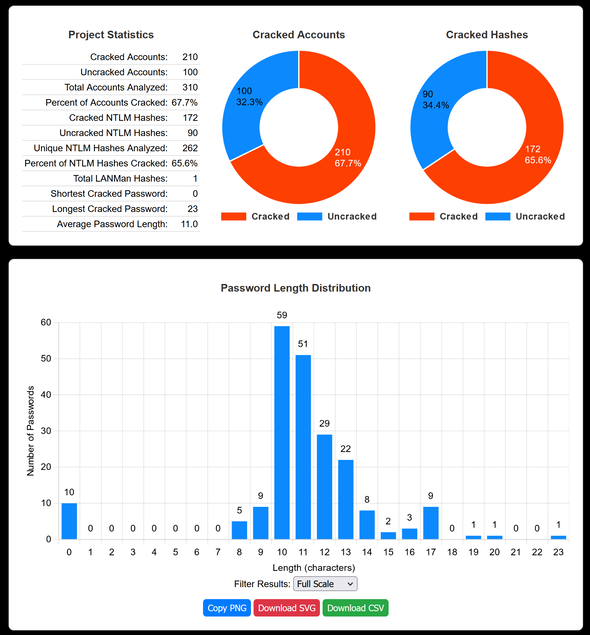

# **Hash Master 1000** Documentation

---

### **Table of Contents**

1.  [Security Disclaimer](#security-disclaimer)
2.  [Introduction](#introduction)
3.  [Use Cases](#use-cases)
4.  [Application Startup](#application-startup)
5.  [Default Login](#default-login)
6.  [Workflow Overview](#workflow-overview)
7.  [Inputs](#inputs)
8.  [File Validation](#file-validation)
9.  [Configurable Settings](#configurable-settings)
10. [Output Report](#output-report)
11. [Hash Dumping Methods](#hash-dumping-methods)
12. [Licensing](#licensing)

---

## **Security Disclaimer**

Hash Master 1000 is intended as an **ad hoc tool** for password and hash analysis. It is **not designed for production environments** unless properly secured by a knowledgeable user. The default deployment lacks advanced security features, and use beyond local or controlled systems is strongly discouraged.

If production use is required:

-   Replace the default Flask server with a robust web server
-   Use a valid TLS certificate
-   Configure appropriate firewall rules to restrict access

The authors assume no responsibility for improper or insecure deployments.

---

## **Introduction**

**Hash Master 1000** is a tool for analyzing Microsoft Windows password hashes and cracked passwords. It processes data from a `pwdump6` file and a `Hashcat potfile` to generate comprehensive reports for penetration testers, auditors and cyber-security professionals. 
Learn more: https://blog.shellntel.com/p/hash-master-1000

### **Features**

-   4-step guided wizard workflow with file validation
-   Password policy compliance checks (length, complexity)
-   Analysis of weak or reused passwords
-   Detection of common/reused dictionary words and substrings
-   Bad Practices Report with 11 detection categories (clickable bars show matching passwords)
-   Company Name & Terms detection for organization-specific keyword matching
-   Visualization of cracking statistics with interactive charts
-   Support for mixed hash type potfiles (auto-detects and filters NTLM)
-   Built-in file browser for local server files
-   Account status awareness (Enabled/Disabled) from DCSync format
-   Export options: PNG clipboard, SVG download, CSV download, JSON data

---

## **Use Cases**

1. Identify weak and reused passwords in an organization
2. Highlight accounts failing policy requirements
3. Generate reports for compliance or presentations

---

## **Application Startup**

### **Requirements**

-   **Python Version:** 3.10+
-   **Python dependencies:** See `requirements.txt`

### **Deployment**

While there are several ways that Hash Master 1000 could be run, using either Docker or a Python Virtual Environment is recommended. As stated earlier, a more persistent installation should only be done by a security professional. If you don't have Docker already installed and working, the native Python Virtual Envrionment is quick and easy.

Some Docker users prefer a zero-config environment, therefore, the application will run with a default Flask secret-key, admin username and admin password. It will also automatically create a self-signed SSL certificate in the Docker home folder when the application starts.

To override the default configuration, edit the included `env.example` file and save it as `.env` inside the local project folder. Likewise, you may configure your own SSL certificate in advance using openssl or the built-in `generate_cert.py` script. Docker will use the user created `.env`, `cert.pem` and `pub.pem` files in the project directory if they are created before building and starting the app.

#### <u>**Docker**</u>

Prerequisites: Install `docker` & `docker-compose` and add the current user to the `docker` group.

Build the docker image

```bash
docker compose build
```

Start the app

```bash
docker compose up -d
```

To stop the app

```bash
docker compose down
```

#### <u>**Virtual Environment** native Python</u>

Prerequisites: Install `python-env`

Set up a virtual environment for project isolation

```bash
python3 -m venv hm1k
```

Activate the virtual environment

```bash
source hm1k/bin/activate
```

Install dependencies

```bash
pip install -r requirements.txt
```

Run application

```bash
python3 hm1k.py
```

---

## **Default Login**

Despite the security disclaimer above, it's important to prevent unauthorized users from easily accessing sensitive data. `Flask-Login` requires users to have a valid login in order to access any of the protected routes/endpoints. The weak default password used by the app is a humorous reminder that complex != secure and to always change your default passwords. :grin:

-   Username: `admin`
-   Password: `Winter2025##`

If you wish to change the username or password, either can be edited in the .env file. The default credentials below allow users to login as `admin` with the password `Winter2025##`. To change the password, bcrypt the password and paste the hash into the .env file.

**.env file:**

`ADMIN_USERNAME="admin"`

`ADMIN_PASSWORD_HASH="$2b$12$eNKlXXTpqFIlXKEAvoUSaujC3MYUMnji4LDoftnnZMMRAwPMN.JkO"`

---

## **Workflow Overview**

Hash Master 1000 uses a guided 4-step wizard workflow to ensure data quality before analysis:

### **Step 1: Load Files**

The first step focuses on loading your source files. You have two options:

-   **Upload Files**: Upload pwdump and potfile directly through the browser
-   **Use Local Server Files**: Specify paths to files already on the server using the built-in file browser

For local server files, click the **Browse** button to open a file browser that lets you navigate the server's filesystem and select files. You can also manually enter file paths if you know them.

Each file must be validated before proceeding. Click the "Validate" button next to each file to check for formatting issues. The interface shows:
-   A visual status indicator (pending, valid, warning, or error)
-   Validation statistics (valid entries, warnings, errors)
-   Format detection (Standard vs DCSync format for pwdump files)
-   Hash type detection (NTLM vs non-NTLM for potfiles)

Both files must pass validation before you can continue to Step 2.

### **Step 2: Validation Review**

After initial validation, you're taken to a dedicated validation review page where you can:
-   See detailed statistics about your files (valid lines, warnings, errors)
-   Review any problematic lines with specific error messages
-   Choose to include or exclude specific lines from analysis
-   See hash type breakdown for potfiles (NTLM hashes are used, others are ignored)
-   View status coverage for pwdump files (what percentage have Enabled/Disabled status)

This step ensures you have full control over what data is processed before analysis begins.

### **Step 3: Configure Analysis**

Configure the analysis options for your report:
-   Substring analysis options (min/max length, frequency threshold)
-   Dictionary word analysis options
-   Password policy compliance settings (min length, complexity requirements)
-   Account filtering options (ignore disabled accounts, ignore computer accounts)
-   Blank password handling

Click "Generate Report" to process your files with the selected options.

### **Step 4: View Report**

The final step displays the comprehensive analysis report with statistics, charts, and detailed findings. From the report page, you can:
-   View all analysis results
-   Copy charts to clipboard as PNG
-   Download charts as SVG or CSV
-   Download all JSON data files
-   Start over with new files

---

## **Inputs**

### **1. Pwdump File**

Hash Master 1000 supports two pwdump formats:

#### **Standard pwdump Format**
-   Extension: `.txt` or `.ntds`
-   Format: `{username}:{user_id}:{LM_hash}:{NTLM_hash}:{SID}:{comment}:{home_directory}`
-   Example: `jdoe:1001:aad3b435b51404eeaad3b435b51404ee:fc525c9683e8fe067095ba2ddc971889:::`

#### **DCSync Format (Recommended)**
-   Extension: `.txt` or `.ntds`
-   Format: `{username}:{RID}:{LM_hash}:{NTLM_hash}:::: (status=Enabled|Disabled)`
-   Example: `DOMAIN\jdoe:1001:aad3b435b51404eeaad3b435b51404ee:fc525c9683e8fe067095ba2ddc971889::: (status=Enabled)`

The DCSync format includes account status information (Enabled/Disabled), which enables more accurate reporting. When status information is available, the report can show:
-   Breakdown of enabled vs disabled accounts
-   Cracked statistics filtered by account status
-   More meaningful security recommendations

**Note:** Both formats can be mixed in the same file. Hash Master 1000 automatically detects the format of each line.

### **2. Hashcat Potfile**

-   Extension: `.txt`, `.potfile`, or `.pot`
-   Format: `{NTLM_hash}:{password}` or `{hash_with_mode}:{password}`
-   Example: `66c4b0305e317b7ee0c90f7d370c885a:Password123#`

**Mixed Hash Type Support:** Potfiles may contain multiple hash types from different cracking sessions. Hash Master 1000 automatically detects and categorizes each hash type:
-   NTLM hashes (32-character hex) are used for analysis
-   Non-NTLM hashes (SHA1, MD5, bcrypt, etc.) are detected and ignored
-   A summary of hash types is shown during validation

This allows you to use your main potfile without needing to filter out non-NTLM entries first.

**Note:** All `$HEX[...]` encoded passwords from the potfile are decoded prior to analysis and reporting.

### **File Requirements**

-   Each file must have one properly formatted entry per line
-   Empty lines and comment lines (starting with `#`) are automatically skipped
-   Files are validated before processing to catch formatting issues early
-   **Your pwdump file must not contain duplicate account names, especially with different hashes**

### **Upload vs Local Server Files**

The Step 1 interface provides a toggle between two input methods:

-   **Upload Files**: Browse and upload files directly from your computer through the browser
-   **Use Local Server Files**: Select files already on the server using the built-in file browser

When using local server files, you can either:
-   Click the **Browse** button to open a file browser modal that lets you navigate the server's filesystem
-   Manually type or paste the full path to the file

The file browser shows directories and files, their sizes, and allows easy navigation with ".." to go to parent directories.

**Note:** To assist in evaluating or testing the application, there are example pwdump and potfile files in the project's `testData/` directory.

---

## **File Validation**

Before processing, Hash Master 1000 validates both input files to ensure data quality. The validation system catches common issues early, preventing corrupted data from affecting your analysis.

### **Validation Process**

1. Click the "Validate" button next to each file after selecting it
2. The system parses each line and checks for formatting issues
3. Results are displayed with statistics and any problems found
4. Both files must pass validation before proceeding

### **Pwdump Validation Checks**

-   **Field Count**: Must have exactly 7 colon-separated fields
-   **Username**: Must not be empty
-   **NTLM Hash**: Must be exactly 32 hexadecimal characters
-   **LM Hash**: Validated if present (warnings for malformed LM hashes)
-   **Format Detection**: Automatically identifies Standard vs DCSync format

### **Potfile Validation Checks**

-   **Format**: Must be `hash:password` format
-   **Hash Type Detection**: Automatically identifies hash types (NTLM, SHA1, MD5, bcrypt, etc.)
-   **NTLM Filtering**: Only NTLM hashes (32-character hex) are used; others are flagged as "ignored"
-   **Password**: Must be present (hash-only lines are flagged)
-   **Hash Type Summary**: Shows breakdown of all hash types found in the file

### **Error Severity Levels**

-   **Fatal**: Line cannot be processed (wrong field count, invalid hash, missing username)
-   **Warning**: Line can be processed but may have issues (malformed LM hash, empty line)
-   **Info**: Informational (comment lines, format detection)

### **Validation Review Page**

If issues are found, you'll be directed to a validation review page where you can:
-   See all problematic lines with detailed error messages
-   Choose to include or exclude specific lines from analysis
-   Review the raw line content to diagnose issues
-   Proceed with only the valid entries

---

## **Configurable Settings**

Configurable settings affect the analysis and reporting of cracked passwords and hash data. A thorough password analysis may require tweaking the substring and dictionary word analysis options, usually to control the number of results. Likewise, it's useful to analyze substrings and dictionary words both with and without supressing any nested strings/words. There are 5 sections of analysis options including:

1. Substring analysis options
2. Dictionary word analysis options
3. Password policy compliance options
4. Company Name & Terms detection
5. Option to treat blank passwords as uncracked

Note: The default settings should work for most basic use cases. Only the pwdump file and Hashcat potfile are required to run a report.

#### **Substring Analysis**

Substing analysis refers to identifying repeating strings of characters within passwords. The longer the repeating string of characters, the more likely that it's a common string (or perhaps word) used within the organization to make passowrds. Any intentional use of a string that exists in multiple passwords is insecure. Substring analysis enhances the more traditional discovery of English dictionary words by discovering any repeating strings, not just words.

-   **Min Substring Length**: Smallest substring length to analyze (# of characters). In a large dataset with many cracked passwords, a longer minumum length is suggested to reduce the number of matches/results. Use this setting along with the Substring Frequency Threshold setting to tune the report output.
-   **Max Substring Length**: Largest substring length to analyze (# of characters).
-   **Substring Freq Threshold**: Minimum frequency required (# of hits). This sets how many account passwords must contain the string to be considered significant enough to be included in the report. This allows the analysis to be tuned to the size of the job. A dataset with thousands of cracked passwords is likely to identify more repeating strings, expecially if used with a low Min Substring Length setting.
-   **Suppress Nested Substrings**: Whether to display substrings within larger substrings. It's common to find repeating strings within larger repeating strings and there may be use cases where you want to analyze both. This is especially useful if you intend to download the CSV or JSON file for offline analysis.
-   **Analyze Substrings in Lowercase**: Normalizes passwords to lowercase before analysis. Normalizing to lowercase is standard for dictionary word analysis, but may not be ideal for substring analysis.

#### **Dictionary Word Analysis**

Dictionary analysis is just as you'd expect, Hash Master 1000 searches each password to see if it contains words from the English language dictionary. Dictionary Word Analysis uses Python's nltk as the list of English words.

-   **Min Word Length**: Minimum word length to include in the analysis. Use caution including words shorter than 4 characters without Suppressing Display Nested Words as you'll likely find many nested words.
-   **Suppress Nested Words**: Select whether to display words within words. For example, the password `Summertime123` includes the words: `summertime`, `summer`, `time`, `sum`, `time`, `me`. Suppressing the nested words would result in only the largest words being reported.

#### **Password Policy Compliance**

The Policy Compliance configurable settings allow the report to be customized to show violations of the effective Group Policy (or local password policy).

-   **Min Password Length**: Minimum length required for a compliant password.
-   **Max Password Age**: Maximum allowable days since last password change (feature coming soon).
-   **Complexity Requirement**: Passwords must meet specific complexity rules (uppercase, lowercase, digit, and special character). Microsoft typically requires 3 out of 4 categories to be complex, but certain implemenations may require all 4 categories. While there is rumor of a 5th complexity category being added, selecting 5 today should cause all cracked passwords to be reported.

#### **Company Name & Terms**

This feature allows you to detect organization-specific terms in cracked passwords. Users commonly incorporate company names, acronyms, department names, product names, or other organization-specific terms into their passwords. This is a significant security risk as these terms are easily guessable by attackers who know the target organization.

Click the **Configure** button to open a modal where you can enter custom keywords:

-   Enter one term per line
-   Terms must be at least 3 characters long (supports short acronyms)
-   Matching is case-insensitive
-   Examples: company name, stock ticker, department names, product names, building names

When configured, a "Company Terms" category appears in the Bad Practices Report chart. Clicking on the bar shows all matching passwords with their occurrence counts.

#### **Ignore Blank Passwords**

This advanced option should be used with care as it will affect nearly all calculations performed. Selecting this option causes all blank passwords to be considered uncracked during analysis.

-   **Do Not Treat Blank Passwords As Cracked**: Allows reports to be generated with blank passwords being calculated as uncracked rather than cracked. Use with caution!

---

## **Output Report**

The HTML report includes:

-   Cracked accounts and hash statistics
-   Password length distribution charts
-   Reused passwords and substrings
-   Password policy compliance violations
-   Accounts with blank passwords



The generated HTML report includes the following sections:

### **Statistics Table**

Provides a high-level overview:

-   Total accounts analyzed
-   Number and percentage of cracked accounts and hashes
-   Shortest, longest, and average password lengths
-   Number of LANMan hashes
-   Number of blank passwords

### **Charts**

-   **Cracked Accounts Pie Chart**: Shows cracked vs. uncracked accounts.
-   **Cracked Hashes Pie Chart**: Compares cracked and uncracked hashes.
-   **Password Length Distribution**: Visualizes the distribution of cracked password lengths.
-   **Top Reused Cracked Passwords**: Highlights commonly reused passwords.
-   **Top Substrings Used**: Displays the most frequent substrings within passwords.
-   **Top Dictionary Words**: Identifies frequent dictionary words found in cracked passwords.
-   **Bad Practices Report**: Interactive bar chart showing passwords matching common bad practice patterns including:
    -   Password Variants (password, p@ssw0rd, passwd, etc.)
    -   Season + Year combinations (Summer2024, Winter2023, etc.)
    -   Keyboard walks (qwerty, asdf, 123456, etc.)
    -   Common weak bases (letmein, welcome, admin, etc.)
    -   Top common passwords
    -   Sequential/repeated characters
    -   Bible verses
    -   Sports teams/mascots
    -   Passwords ending with # or !
    -   Leet-speak substitutions
    -   Company Terms (when configured)

    **Click on any bar** to see all matching passwords with their occurrence counts in a scrollable modal.

**Note**: All charts can be copied to the clipboard as PNG, downloaded as SVG, or downloaded as CSV, using the buttons below each chart.

### **Password Reuse Table**

Displays reused NTLM hashes, their counts, and associated accounts.

### **Policy Compliance Tables**

1. **Accounts Failing Minimum Length Policy**:
   Lists accounts with passwords shorter than the required length.
2. **Accounts Failing Complexity Policy**:
   Highlights accounts with passwords that do not meet complexity requirements.
3. **Accounts With Blank Passwords**:
   Shows accounts where passwords are blank (also treated as cracked in reports).
4. **Accounts Failing Maximum Age Policy**:
   Lists accounts with expired passwords (future implementation).

**Note:** At the bottom of the report page, there is a **Download All JSON Files** button. Each chart and table on the page loads a JSON object that includes the necessary data to populate the chart or table. Downloading the JSON files gives you the ability to use the raw data for other purposes outside of Hash Master 1000.

### **Important Notes**

1. **Password Cracking Data**: The analysis includes only cracked passwords. Many hashes remain uncracked, so the report represents a subset of the total accounts.
2. **Accounts vs. Hashes**: Due to password reuse, the number of cracked accounts may exceed the number of unique cracked hashes.
3. **Blank Passwords**: Accounts with blank passwords are reported as cracked. Therefore, blank passwords have a zero character length and include zero complexity categories. It is critical that accounts with blank passwords are disabled.
4. **Account Status**: When using DCSync format files with status information, the report can distinguish between enabled and disabled accounts. This provides more accurate security assessments by showing which vulnerable accounts are actively in use. If status information is incomplete (less than 100% coverage), a warning will be displayed during validation.

---

## **Hash Dumping Methods**

### **1. Using pwdump**

Standard pwdump extraction:
```bash
pwdump > hashes.txt
```

### **2. Impacket SecretsDump**

Basic extraction:
```bash
secretsdump.py -just-dc SAMDOMAIN/user:password@dc_ip
```

**To get DCSync format with account status** (recommended):
```bash
secretsdump.py -just-dc -user-status SAMDOMAIN/user:password@dc_ip
```

The `-user-status` flag includes `(status=Enabled)` or `(status=Disabled)` suffix on each line, enabling full account status analysis in Hash Master 1000.

### **3. Using AD Backups**

Extract hashes from an AD backup or snapshot using tools like `ntdsutil` or offline NTDS.dit extraction.

For detailed guidance, refer to trusted resources on Windows security and password extraction.

---

## **Source**

SynerComm is a leader in cybersecurity and penetration testing. Learn more about how Hash Master 1000 uses substring analysis to identify patterns in cracked passwords.
https://www.synercomm.com/password-security-substring-analysis/

---

## **Licensing**

This project is licensed under the **Creative Commons Attribution-NonCommercial 4.0 International License (CC BY-NC 4.0)**. This allows for free use and modification, provided:

-   Commercial use is prohibited.
-   Attribution to the original author is maintained.

For more information, see the [LICENSE](LICENSE) file.
